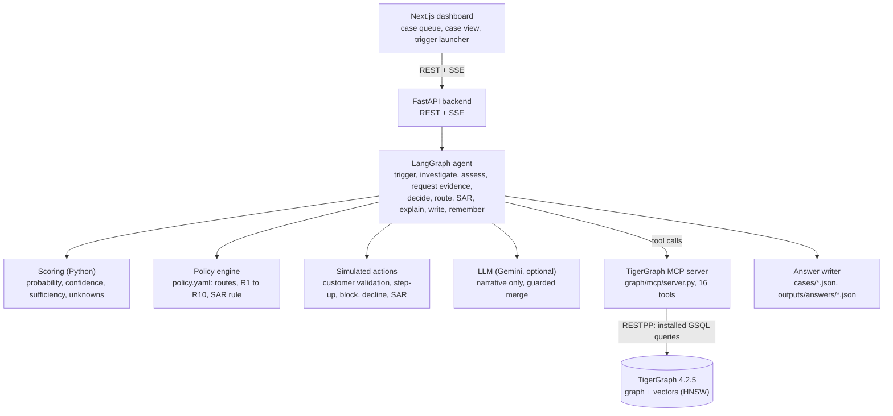
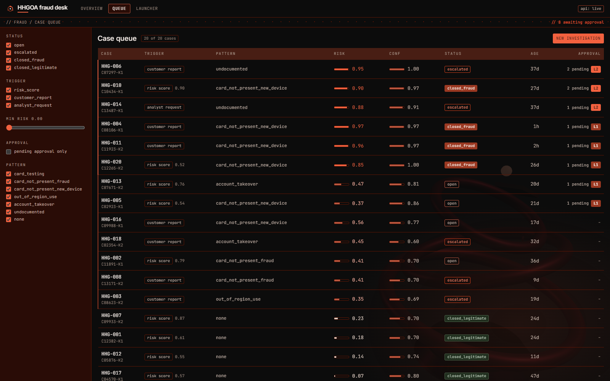
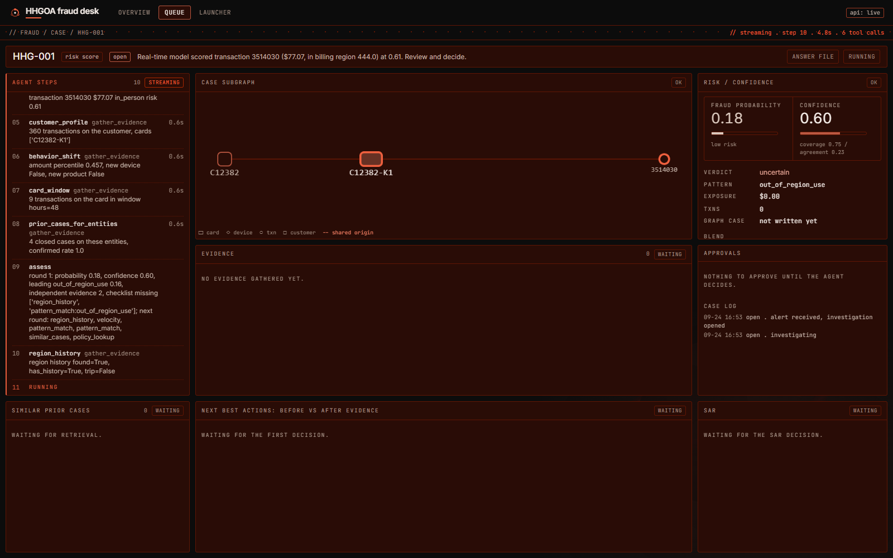
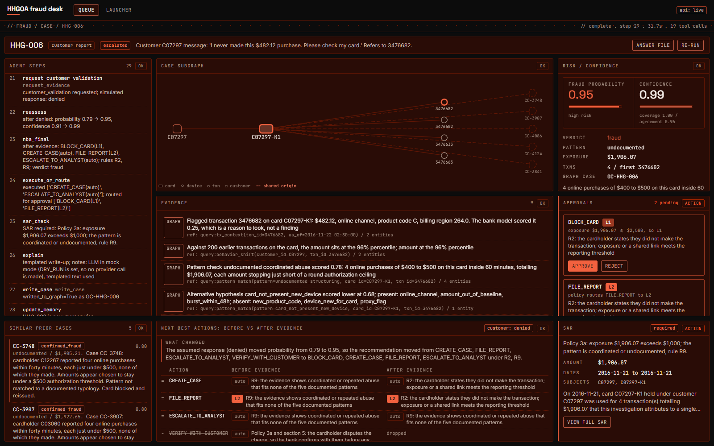
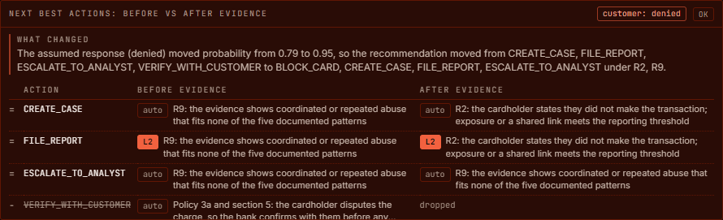
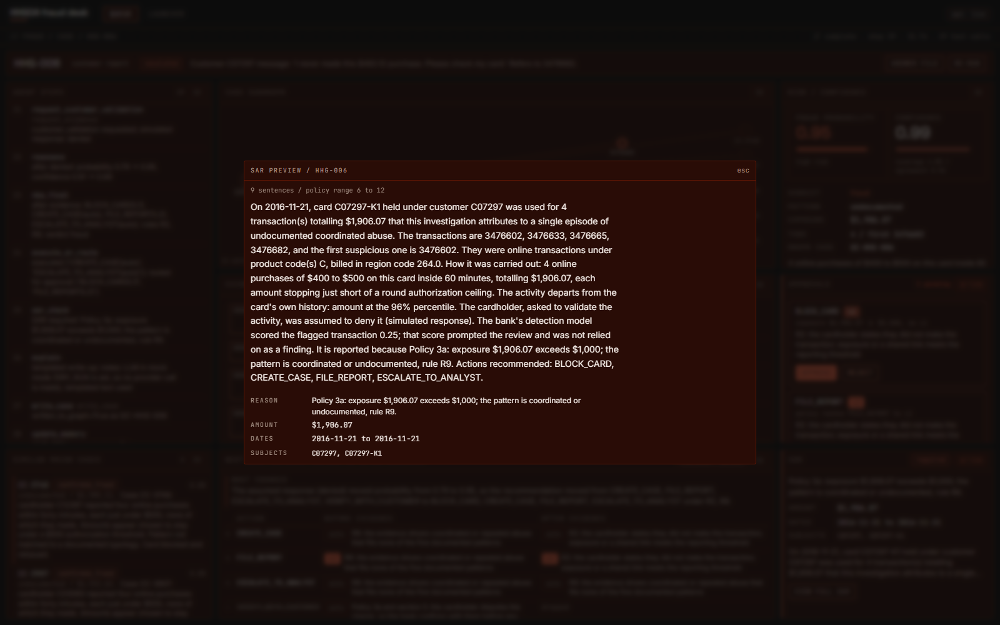
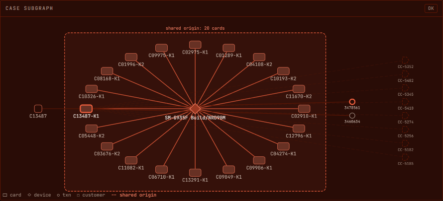
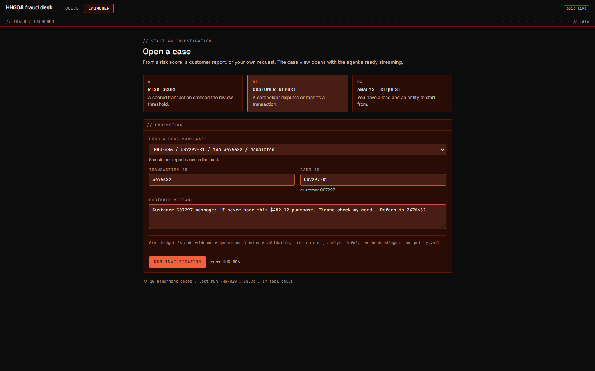

# HHGOA fraud desk: an agentic fraud investigator on TigerGraph

This repo is our entry for the TigerGraph HHGOA agentic fraud investigation task.
It takes a fraud alert (a bank risk score, a customer complaint, or an analyst
request), investigates it against a TigerGraph graph built from the HHGOA IEEE
dataset, decides how sure it is, asks for more evidence when it is not sure
enough, recommends next best actions under the bank's written policy, routes
anything high impact to a human, drafts a SAR when the policy calls for one, and
writes the finished case back into the graph so later investigations can find it.

It produces one answer file per benchmark case (`cases/HHG-001.json` to
`cases/HHG-020.json`) in the format the dataset README defines, and an analyst
dashboard that shows a case being worked step by step.

## What it does, and what it does not

What it does:

- Every read goes through installed GSQL queries with an `as_of` cut at the case's
  `opened_at`. Nothing after the trigger time is read.
- Risk (fraud probability) and confidence are separate numbers, both computed in
  Python from graph evidence. The LLM does not set either.
- Actions are gated by `backend/contracts/policy.yaml`. The agent only executes
  actions routed `auto`. `L1` and `L2` actions are recorded as recommendations
  with their approval route and wait for a human.
- Customer and step-up replies are simulated, because the dataset supplies none.
  The simulation is deterministic and is recorded in `evidence_requests` as an
  assumption (see `backend/contracts/evidence_simulation.md`).
- Each finished case is written to the graph as an `InvestigationCase` vertex with
  its decisions, entity links and an embedding, and becomes memory for cases
  opened after it.

What it does not do:

- It does not call real bank systems. Blocks, declines, SAR filings and customer
  messages are stubs that log to the case record.
- The LLM does not choose which query to run. The investigation plan is code: a
  fixed first round, then follow-up queries chosen from what the first round
  showed. The LLM writes the summary, stop reason, "what changed" and SAR prose,
  and its text is thrown away if it names an ID the agent never saw, claims an
  approval-gated action already happened, or breaks the SAR length rule.
- It does not treat the bank's `risk_score` as a verdict. It is one input to the
  probability blend.
- It is not tuned against labels for the benchmark window. The closed cases run
  July to October 2016 and the benchmark cases November to December; the closed
  cases are memory only.

## Architecture



The same diagram in text, for places that do not render mermaid:

```
Next.js dashboard  (case queue, case view, launcher)
        |  REST + SSE
FastAPI backend  (backend/api/main.py)
 |-- LangGraph agent  (backend/agent/graph.py, nodes.py)
 |     |-- tool layer: TOOL_BACKEND = mcp | tg | mock
 |     |      mcp -> graph/mcp/server.py -> RESTPP -> installed GSQL queries
 |     |      tg  -> backend/tools/tg/backend.py -> RESTPP (same class the MCP server wraps)
 |     |      mock -> pandas slice of the real CSVs, for work without a graph
 |     |-- scoring: probability, confidence, sufficiency checklist, unknowns
 |     |-- policy engine: policy.yaml routes (auto, L1, L2), rules R1 to R10, SAR rule
 |     |-- GraphRAG: vector top-k (policy chunks, patterns, cases) + entity expansion
 |     |-- case memory: ClosedCase + InvestigationCase vertices, as_of filtered
 |     |-- simulated evidence and actions, all logged as decisions
 |     `-- LLM (optional): narrative fields only
 `-- answer writer: InternalCase -> README answer format, schema validated
TigerGraph 4.2.5 Community Edition in Docker (infra/docker-compose.yml)
```

Agent state machine (`backend/agent/graph.py`):

```
trigger -> open_case -> plan -> gather_evidence <-> assess (loop, bounded)
  -> nba_initial -> policy_check_initial
  -> [needs evidence?] yes -> request_evidence -> reassess -> nba_final
                       no  -> nba_final
  -> policy_check_final -> execute_or_route -> sar_check -> explain
  -> write_case -> update_memory -> finalize (answer file)
```

## Stack

| Piece | What we use it for | Where |
|---|---|---|
| TigerGraph 4.2.5 Community Edition, Docker | The graph: 590,742 transactions, 14,317 cards, 13,553 customers, 9,706 device profiles, 5,565 closed cases, plus vectors | `infra/`, `graph/schema/` |
| GSQL loading jobs | Bulk load from prepared CSVs | `graph/loading/load_all.gsql`, `graph/prep/prepare.py` |
| GSQL installed queries | 20 queries: entity, network, memory, pattern and writer queries (plus the GDS algorithm queries and `card_community`) | `graph/queries/01_entity.gsql` to `05_writers.gsql` |
| Graph algorithms (GDS library) | WCC, Louvain and PageRank over a card-to-card shared-device projection; Jaccard installed for neighbourhood overlap | `graph/algorithms/` |
| TigerVector (HNSW, cosine) | 384-dim embeddings on `PolicyChunk`, `FraudPattern`, `ClosedCase`, `InvestigationCase` | `graph/schema/schema.gsql`, `graph/prep/embed_and_upsert.py` |
| TigerGraph MCP | Our investigation MCP server (16 named tools) and the official `tigergraph-mcp` server, read-only, on the same queries | `graph/mcp/` |
| GraphRAG | Vector top-k over policy and case text, blended with entity overlap from the graph, deduplicated and token budgeted | `backend/graphrag/`, `similar_cases` and `policy_search` queries |
| LangGraph | The investigation state machine with its evidence loop | `backend/agent/` |
| FastAPI | REST and SSE for the dashboard, approval endpoint | `backend/api/main.py` |
| Next.js 15, Tailwind 4, Cytoscape | Analyst dashboard | `frontend/` |
| Gemini (optional) | Narrative text only; the run works with `DRY_RUN=true` and no key | `backend/llm/` |
| bge-small-en-v1.5 | Local embeddings, no API key | `sentence-transformers` |

## Repository layout

```
backend/            agent, tools, scoring, policy, GraphRAG, memory, API, answer writer
backend/contracts/  answer.schema.json, policy.yaml, tools.md, identifiers.md, ...
graph/schema/       schema.gsql (core + vectors), schema_analytics.gsql (algorithm projection)
graph/prep/         prepare.py, seed_documents.py, embed_and_upsert.py
graph/loading/      load_all.gsql, drop_jobs.gsql
graph/queries/      01_entity to 05_writers, install_all.sh
graph/algorithms/   GDS installs, card projection, run_analytics.sh
graph/mcp/          MCP server, tool descriptions, mcp_config.json
frontend/           Next.js dashboard
cases/              the 20 graded answer files
outputs/answers/    mirror of cases/
outputs/internal/   full InternalCase per case (what the dashboard renders)
infra/              docker-compose for TigerGraph
docs/               blog, demo script, social post
```

## Setup

Tested on Windows 11 with Git Bash and Docker Desktop. The shell scripts are bash;
on Windows run them from Git Bash. You need Docker, Python 3.10 or later, and
Node 20 or later (built and tested on Node 26).

### 1. Get the dataset

The dataset is not in the repo. Put the HHGOA IEEE files in `data/` at the repo
root:

```
data/README.md
data/transactions.csv
data/identity.csv
data/closed_cases_history.csv
data/case_pack.csv
```

### 2. Environment

```
cp .env.example .env
```

Set at least:

| Key | Value |
|---|---|
| `TG_PASSWORD` | the TigerGraph password (container default is `tigergraph`) |
| `TOOL_BACKEND` | `mcp` to go through the MCP server, `tg` to call RESTPP directly, `mock` to run without a graph. The code default is `mock` |
| `MCP_SERVER_URL` | `http://localhost:8765/sse` when `TOOL_BACKEND=mcp` |
| `DRY_RUN` | `true` (code default) runs with no LLM calls and templated text; `false` plus `GOOGLE_API_KEY` turns on the Gemini narrative pass |
| `GOOGLE_API_KEY` | optional, only needed with `DRY_RUN=false` |


### 3. Python

```
python -m venv .venv
source .venv/Scripts/activate        # Git Bash on Windows; .venv/bin/activate elsewhere
pip install tigergraph-mcp uvicorn starlette requests python-dotenv
pip install -r backend/requirements.txt
```

The first line is for the MCP server (`graph/mcp/README.md`). Keep the order:
`tigergraph-mcp` pulls `mcp` 2.x, which breaks `langchain-mcp-adapters==0.1.7`,
so `backend/requirements.txt` goes second and its `mcp>=1.30,<2` pin wins. Our
MCP server in `graph/mcp/server.py` runs on `mcp` 1.x.

### 4. Start TigerGraph

```
docker compose -f infra/docker-compose.yml up -d
docker logs -f hhgoa-tigergraph          # wait until the cluster is up
curl -s http://localhost:14240/api/ping
```

The image is pinned to `tigergraph/community:4.2.5`. `data/` is mounted read
only at `/home/tigergraph/data`. GraphStudio is at http://localhost:14240. Use
`docker compose -f infra/docker-compose.yml stop` to stop it; `down -v` deletes
the loaded graph. More in `infra/README.md`.

### 5. Prepare the CSVs

```
python graph/prep/prepare.py            # derives card_id, NEXT edges, device profiles, slim columns
python graph/prep/seed_documents.py     # cuts data/README.md into FraudPattern and PolicyChunk rows
```

Output lands in `graph/prepared/` (git ignored, `transactions_slim.csv` alone is
133 MB). `graph/prepared/MANIFEST.txt` lists row counts.

### 6. Schema and load

There is no single load script; these are the steps we ran. The paths inside `load_all.gsql` expect the prepared CSVs at
`/home/tigergraph/prepared`, and the compose file does not mount that folder, so
they are copied in.

```
export MSYS_NO_PATHCONV=1                # Git Bash only, stops /home/... being rewritten
C=hhgoa-tigergraph
G=/home/tigergraph/tigergraph/app/cmd/gsql

docker cp graph/prepared $C:/home/tigergraph/prepared
docker exec -u root $C chown -R tigergraph /home/tigergraph/prepared      # loading jobs run as tigergraph

docker cp graph/schema/schema.gsql $C:/tmp/schema.gsql
docker exec -u tigergraph $C $G /tmp/schema.gsql

docker cp graph/loading/load_all.gsql $C:/tmp/load_all.gsql
docker exec -u tigergraph $C $G /tmp/load_all.gsql
for job in load_customers load_cards load_devices load_transactions load_closed_cases; do
  docker exec -u tigergraph $C $G -g FraudInvestigation "RUN LOADING JOB $job"
done
```

To reload, run `graph/loading/drop_jobs.gsql` first (4.2.5 has no
`CREATE OR REPLACE` for loading jobs).

Check the counts (from `graph/mcp/README.md`):

```
curl -s -u tigergraph:tigergraph -X POST \
  http://localhost:14240/restpp/builtins/FraudInvestigation \
  -d '{"function":"stat_vertex_number","type":"*"}'
```

Expect Transaction 590742, Card 14317, Customer 13553, ClosedCase 5565,
DeviceProfile 9706. PolicyChunk (30) and FraudPattern (7) arrive in the next step.

### 7. Embeddings

```
python graph/prep/embed_and_upsert.py
```

Embeds the closed cases, the policy chunks and the fraud patterns with
`BAAI/bge-small-en-v1.5` (384 dims) and upserts them over REST. Policy chunks go
in over REST rather than a loading job because they contain newlines, and the
line-based loader drops multi-line quoted fields without reporting an error.

### 8. Install the queries

```
bash graph/queries/install_all.sh       # creates every query, then INSTALL QUERY ALL (3 to 6 minutes)
```

Optional analytics layer (WCC, Louvain, PageRank on the card projection):

```
docker cp graph/schema/schema_analytics.gsql hhgoa-tigergraph:/tmp/
docker exec -u tigergraph hhgoa-tigergraph /home/tigergraph/tigergraph/app/cmd/gsql /tmp/schema_analytics.gsql
bash graph/queries/install_all.sh       # again, so install_gds.gsql and card_community.gsql install
bash graph/algorithms/run_analytics.sh
```

See `graph/algorithms/README.md` for what it found.

### 9. MCP server

```
python graph/mcp/set_query_descriptions.py   # writes tool descriptions onto the installed queries
python graph/mcp/server.py                   # SSE on http://127.0.0.1:8765/sse
```

`python graph/mcp/server.py --transport stdio` runs it for Claude Desktop, Cursor
or Claude Code; `graph/mcp/mcp_config.json` has both our server and the official
`tigergraph-mcp` server configured (the official one limited to read-only tools).
Full notes in `graph/mcp/README.md`.

### 10. Backend

```
uvicorn backend.api.main:app --port 8000
```

`GET /health` reports which tool backend and LLM mode are active.

### 11. Frontend

```
cd frontend
npm install
cp .env.example .env.local
# set NEXT_PUBLIC_API_URL=http://localhost:8000 in .env.local
npm run dev                               # http://localhost:3000
```

With `NEXT_PUBLIC_API_URL` empty the dashboard runs on bundled mock cases in
`frontend/lib/mock/`. Note the frontend reads `NEXT_PUBLIC_API_URL` from
`frontend/.env.local`, not from the root `.env`.

### Quick start (after setup)

Once the graph is loaded and dependencies are installed, one command brings up
TigerGraph, the MCP server, the API and the dashboard:

```
bash scripts/start_demo.sh               # http://localhost:3000
```

## Reproducing the 20 answer files

With TigerGraph loaded, queries installed and the MCP server running:

```
# .env: TOOL_BACKEND=mcp, MCP_SERVER_URL=http://localhost:8765/sse
python -m backend.run_cases -v
```

This runs all 20 cases from `data/case_pack.csv` in `opened_at` order, not case id
order, so a case closed earlier in calendar time is memory for a later one. A full
run clears the agent-written memory first, so an old run's later cases cannot leak
into an earlier one. Each case writes:

- `cases/<case_id>.json`: the graded answer file, validated against
  `backend/contracts/answer.schema.json` before it is written
- `outputs/answers/<case_id>.json`: an identical copy
- `outputs/internal/<case_id>.json`: the full internal case (steps, risk
  components, confidence, unknowns, decisions) that the dashboard reads

Other options:

```
python -m backend.run_cases --case HHG-014 -v     # one case
python -m backend.run_cases --keep-memory         # do not clear agent memory first
python -m pytest backend/tests/test_agent.py      # validates every written answer file
```

The run is deterministic with `DRY_RUN=true`: same graph, same answer files. With
the LLM on, only the prose fields can change, and only when the model's text
passes the guards in `backend/agent/narrative.py`.

To run without TigerGraph (for development only, not how the submission was
produced): leave `TOOL_BACKEND=mock` and build the pandas slice once with
`python -m backend.tools.mock.build_card_index` and
`python -m backend.tools.mock.extract_slice`.

The committed answer files came from a full run with `TOOL_BACKEND=mcp`: every
tool call went through the MCP server to TigerGraph, and each case is stored as
an `InvestigationCase` vertex `GC-<case_id>`. The Gemini free tier ran out of
daily quota during that run, so the prose fields are the deterministic templates
(`tokens: 0`). Rerunning with `DRY_RUN=false` once quota is available only
changes prose fields that pass the narrative guards.

## Results

See `outputs/eval_report.md` for the format validation, the check that every case
exists in the graph, and the backtest on closed cases.

| Check | Result |
|---|---|
| Answer files valid (schema plus README rules) | 20 / 20, 0 errors, 0 warnings |
| Cases stored in TigerGraph as `InvestigationCase` with evidence and decisions | 20 / 20 |
| Benchmark verdicts | 7 legitimate, 7 uncertain, 6 fraud; 3 SARs (HHG-006, HHG-010, HHG-014) |
| Backtest on 50 closed cases (25 cleared, 25 confirmed), no leakage | 0 errors, 0 self-leaks |
| Precision on fraud calls | 69% |
| Recall on fraud calls (uncertain counts as a miss) | 36% |
| Recall if uncertain counts as caught | 92% |
| Cleared cases called legitimate | 48% |
| Pattern accuracy on confirmed cases | 48% |

The agent leans toward "uncertain" on confirmed fraud rather than guessing. In
an investigation tool I think that is the right side to err on, because an
uncertain case goes to an analyst with its evidence and unknowns, while a
wrong "legitimate" closes it. An earlier version weighted a new device too
heavily and called most false alarms fraud; the backtest caught that and the
fix took cleared-case probability from 0.64 down to 0.35 on average, against
0.61 for confirmed fraud. The backtest ran on the mock backend with templated
narratives (the Gemini free tier ran out of daily quota), so treat it as a
sanity check, not a benchmark.

## Screenshots

Taken from the dashboard running against the live API over MCP.

**Case queue**: risk, confidence, status and pending approvals for the 20 benchmark cases.



**Live run**: agent steps streaming in while HHG-006 is investigated.



**Case view**: evidence with sources, risk and confidence, unknowns, similar prior cases.



**Next best actions before and after evidence**, with what changed.



**SAR preview** for HHG-006.



**Shared device ring** found on HHG-014.



**Trigger launcher**



## Contracts worth reading

- `backend/contracts/answer.schema.json`: the graded answer format
- `backend/contracts/policy.yaml`: actions, routes, R1 to R10, SAR triggers, stopping
- `backend/contracts/tools.md`: every tool, its inputs and outputs, the `as_of` rule
- `backend/contracts/identifiers.md`: how `card_id` and device profiles are derived
- `backend/contracts/evidence_simulation.md`: how simulated replies are decided
- `backend/contracts/internal_case.md`: why there is an internal case and an answer file

## More

- `docs/blog.md`: how it is built and what we learned
- `docs/demo_script.md`: the demo video shot list
- `graph/mcp/README.md`, `graph/algorithms/README.md`, `infra/README.md`
